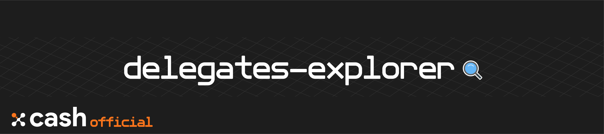

<div align=middle>

<a align="center" href="https://x-network.io/xcash"></a>

[](https://opensource.org/licenses/MIT)
[](https://discordapp.com/invite/4CAahnd)

</div>

# X-Cash Delegates Explorer

**🔍 Check delegates, vote statistics and latest block created.**  

*Admin-panel-styled dashboard forked from [cdk-admin](https://github.com/codetok/cdk-admin), an Angular 6 admin panel using angular material.*

## Table of Contents

- [Table of Contents](#table-of-contents)
- [Features](#features)
- [License](#license)
- [Contributing](#contributing)
- [Documentation](#documentation)
- [Security](#security)
- [System Requirements](#system-requirements)
- [Installation Process](#installation-process)
  - [Dependencies](#dependencies)
  - [Requirements](#requirements)
  - [Develop](#develop)
  - [Testing](#testing)

## Features

**One-stop Dashboard**  
Scroll through all the delegates, their statistics, votes and reserve proofs received.

**Vote Instructions**  
You want to become a delegate ? You will find all the information here to register. Want to help a delegate get elected ? Then see how to vote for him/her.

**Blocks Information**  
The delegate explorer also acts as the X-Cash blockchain explorer. Verify the content of the blocks at any given time.

## License

**The X-Cash Delegate Explorer is an open-source project managed by the X-Cash Foundation**.  
We are operating under the [MIT License](LICENSE).

## Contributing

**Thank you for thinking of contributing! 😃**   
If you want to help out, check [CONTRIBUTING](https://github.com/X-CASH-official/.github/blob/master/CONTRIBUTING.md) for a set of guidelines and check our [opened issues](https://github.com/X-CASH-official/delegates-explorer/issues).

## Documentation

We are hosting our documentation on **GitBook** 👉 [**docs.xcash.foundation**](https://docs.xcash.foundation/)

> You can contribute directly on our [`gitbook-docs`](https://github.com/X-CASH-official/gitbook-docs) repository.

## Security 

If you discover a **security** vulnerability, please send an e-mail to [security@xcash.foundation](mailto:security@xcash.foundation).  
All security vulnerabilities concerning the X-Cash blockchain will be promply addressed.

## System Requirements

*The explorer is optional for delegates to run, as the network nodes will run it already.*

To run the delegates explorer, it needs to be on the same server as an X-Cash node. The system requirements for running a node are in the [`xcash-dpops`](https://github.com/X-CASH-official/xcash-dpops/tree/master#system-requirements) repository.

> At the moment, [`xcash-dpops`](https://github.com/X-CASH-official/xcash-dpops/) is only available for Linux/Unix distributions.

## Installation Process

### Dependencies

> The following table summarizes the tools and libraries required to run the delegates explorer.

| Dependencies | Min. version   | Ubuntu package                                                      |
| ------------ | -------------- | ------------------------------------------------------------------- |
| `Node.js`      | 8              | install from binaries                                               |
| `Angular`      | 6              | install from `npm`                                                    |
| `xcash-dpops`  | latest version | [build from source](https://github.com/X-CASH-official/xcash-dpops) |


**If you want to run the website using SSL then you will need to install a webserver like nginx  
The readme shows you how to setup the website using HTTP, since there is no sensitive data in the website**

### Requirements

#### Intalling Node.js from binaries

> It is recommended to install the nodejs folder in the home directory `/home/$USER/` or root directory (`/root/`) in a new folder

To download, go to the Node.js official [release page](https://nodejs.org/en/download/current/) and download the **Linux Binaries**. Copy it to your deisgnated folder and run these commands:

```bash
tar -xf node*.tar.xz
rm node*.tar.xz
```

Then add Node.js to your path:

```bash
echo -e '\nexport PATH=path_to_nodejs/bin:$PATH' >> ~/.profile && source ~/.profile
```
> Replace `path_to_nodejs/bin` with the location of the `bin` folder where you installed Node.js

#### npm

> Note if your installing on a `root` session, you need to run these additional commands before upgrading
> ```bash
> npm config set user 0 
> npm config set unsafe-perm true
> ```

Update `npm` globally:
```bash
npm install -g npm
```

#### angular 

Install the latest version of Angular globally: 
```shell 
npm install -g @angular/cli@latest
```

Then install the compressor `UglifyJS` globally : 
```shell
npm install -g uglify-js
```

### Develop

#### Clone repository

In your desired folder, clone the repository:
```shell
git clone https://github.com/X-CASH-official/delegates-explorer.git
``` 

#### Install dependencies

```shell
~cd /delegates-explorer
npm install
```

#### Redirect port 80 to 18283

Make sure to follow the steps to [setup the firewall for `xcash-dpops`](https://github.com/X-CASH-official/xcash-dpops#how-to-setup-the-firewall)

#### Build

To build the delegate explorer, go to the `delegates-explorer` folder and run:
```shell
npm run build
```

It will build in the `dist`folder.

Compress the `.js` files with `Uglify-JS` and move all of the contents of this folder to your `xcash-dpops/` folder

```shell
cd dist
for f in *.js; do echo "Processing $f file.."; uglifyjs $f --compress --mangle --output "{$f}min"; rm $f; mv "{$f}min" $f; done
rm -r ~/xcash-dpops/delegates-explorer
mkdir ~/xcash-dpops/delegates-explorer
cd ../
cp -a dist/* ~/xcash-dpops/delegates-explorer/
```

### Testing

```shell
npm test
``` 

To test that you have properly configured the delegates explorer, run `xcash-dpops` with the `--test_data_add` flag. *This will add test datas to the MongoDB.*

Now run the website server again using the normal options.

Next, navigate to your servers IP address or website domain. You should now see the website and some test data. You can navigate through the website using the test data.

When you have verified that the website works correctly, remove the test data by shutting down the `xcash-dpops` and then running it again with the `--test_data_remove` flag.  

